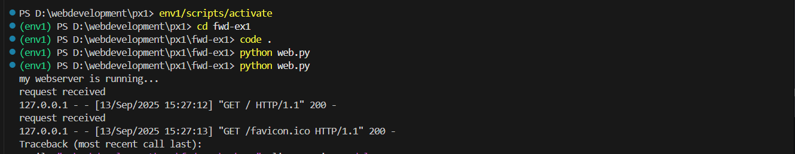

# EX01 Developing a Simple Webserver
## Date:13/09/2025

## AIM:
To develop a simple webserver to serve html pages and display the list of protocols in TCP/IP Protocol Suite.

## DESIGN STEPS:
### Step 1: 
HTML content creation.

### Step 2:
Design of webserver workflow.

### Step 3:
Implementation using Python code.

### Step 4:
Import the necessary modules.

### Step 5:
Define a custom request handler.

### Step 6:
Start an HTTP server on a specific port.

### Step 7:
Run the Python script to serve web pages.

### Step 8:
Serve the HTML pages.

### Step 9:
Start the server script and check for errors.

### Step 10:
Open a browser and navigate to http://127.0.0.1:8000 (or the assigned port).

## PROGRAM:
~~~
 <!DOCTYPE html>
<html lang="en">
<head>
  <meta charset="UTF-8">
  <meta name="viewport" content="width=device-width, initial-scale=1.0">
  <title>TCP/IP Protocol Table</title>
  
</head>
<body>

  <h2>TCP/IP Protocol Layers</h2>

  <table>
    <tr>
      <th>Layer</th>
      <th>Protocols</th>
      <th>Functions</th>
    </tr>
    <tr>
      <td>Application</td>
      <td>HTTP, FTP, SMTP, DNS</td>
      <td>Provides services for end-user applications</td>
    </tr>
    <tr>
      <td>Transport</td>
      <td>TCP, UDP</td>
      <td>End-to-end communication, reliability, error checking</td>
    </tr>
    <tr>
      <td>Internet</td>
      <td>IP (IPv4, IPv6), ICMP</td>
      <td>Logical addressing and routing of packets</td>
    </tr>
    <tr>
      <td>Network Access (Link)</td>
      <td>Ethernet, Wi-Fi, ARP</td>
      <td>Defines physical addressing and access to media</td>
    </tr>
  </table>

</body>
</html>

"""
~~~

## OUTPUT:

## RESULT:
The program for implementing simple webserver is executed successfully.

